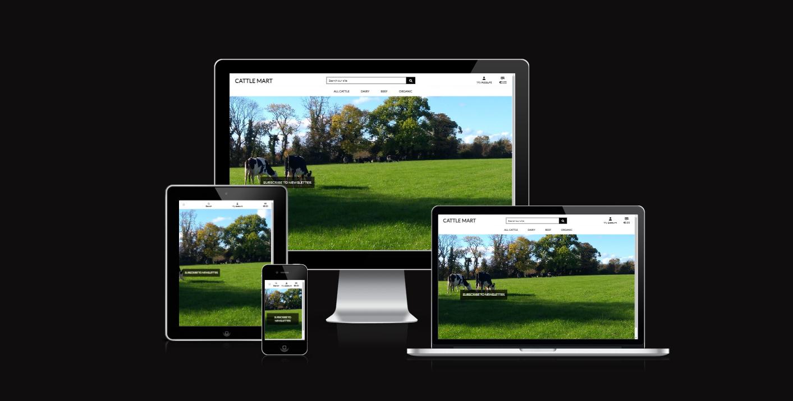

# Cattle-Mart

A catle sales website. Code Institute Portfolio 5 Assessment
#### - By FarmerEd

### **[Live Site:]([https://agri-hacks-60be548e369f.herokuapp.com/](https://cattle-mart-42a123405ccb.herokuapp.com/))**  
### [Repository:](https://github.com/Farmer-Eds-Shed/Cattle-Mart/)

---

## Contents
<a name="contents"><a>
 1. [ User Experience UX ](#user-experience-ux)
 1. [Agile Development](#agile-development)
 1. [ Features ](#features)   
 1. [ Technology used ](#technology-used) 
 1. [ Testing ](#testing)  
 1. [ Bugs ](#bugs)  
 1. [ Deployment ](#deployment)
 1. [ SEO ](#seo)
 1. [ Marketing ](#marketing)
 1. [ Business Model](#business)
 1. [ Credits](#credits)
  

## User Experience UX

A visitor to Cattle-Mart would be a farmer looking to purchase animals for any cattle enterprise Beef/Dairy/Organic 
### User Stories

#### Epic | Site Deployment

#### Epic | User Managment
- As a Site User I can register an account so that I can comment on and create new blog posts.
- As a Site Admin I can manage user accounts.

#### Epic | Site Navigation

#### Epic | E-Commerce

#### Epic | Marketing

#### Epic | Contact

#### User stories not yet implemented
The following user stories were scoped out of the project due to time constraints and labelled as "Won't Have Now" on the project board on GitHub. It is intended that these user stories will be implemented later.

[Back to Top of page](#contents)

### PLanning

- Database Schema

   ### Cattle
    - #### Enterprise
        | id | Field |
        |--|--|
        |name|CharField|

     - #### StockType
        | id | Field |
        |--|--|
        |name|CharField|

     - #### Breed

        | id | Field |
        |--|--|
        |name|CharField|
        |code|CharField|
      
    - #### Cattle
        | id | Field |
        |--|--|
        |enterprise|ForeignKey|
        |stock_type|ForeignKey|
        |tag||CharField|
        |name|CharField|
        |breed|ForeignKey|
        |description|TextField|
        |price|IntegerField|
        |star_rating|IntegerField|
        |cbv|IntegerField|
        |image_url|UrlField|
        |image|ImageField|
        |sold|BooleanField|

   ### Checkout
    - #### Order
        | id | Field |
        |--|--|
        |order number|CharField|
        |user_profile|ForeignKey|
        |full_name|CharField|
        |email|EmailField|
        |phone_number|CharField|
        |country|CountryField|
        |postcode|CharField|
        |town_or_city|CharField|
        |street_address1|CharField|
        |street_address2|CharField|
        |county|CharField|
        |date|DateTimeField|
        |delivery_cost|DecimalField| *To Be removed as not used
        |Order_Total|DecimalField|
        |Grand_Total|DecimalField| *To Be removed as not used
        |original_trailer|TextField|
        |stripe_PID|CharField

    - #### OrderLineItem
        | id | Field |
        |--|--|
        |order|ForeignKey|
        |cattleForeignKey|
        |quantity|IntegerField|
        |line_item_total|DecimalField
        |Read|BooleanField|

   ### Contact
    - #### Feedback
        | id | Field |
        |--|--|
        |issue|ForeignKey
        |name|CharField|
        |email|EmailField|
        |message|TextField|

   ### Profile
    - #### UserProfile
        | id | Field |
        |--|--|
        |user|OneToOneField
        |default_phone_number|CharField|
        |default_country|CountryField|
        |default_postcode|CharField|
        |default_town_or_city|CharField|
        |default_street_address1|CharField|
        |default_street_address2|CharField|
        |default_county|CharField|

[Back to Top of page](#contents)

## Agile Development

This project was developed following the principles of Agile Development, GitHub Projects and Milestones were used to track planning and progress.  

User stories were created as Issues and assigned to a Milestone(Epic), progress was tracked via the projects board. Each user story was given an acceptance criteria to clearly define when it was completed.  

As User Stories were worked on they were moved into the "In Progress" section of the Project board, when a user story matched its acceptance criteria it was closed and moved the  "Done" section. When new features were decided upon after the initial project planning they were also added to the "To Do" Section. 

[Back to Top of page](#contents)

## Features

#### User based Features Implemented:

#### Admin based features Implemented:

#### Account restrictions:

### Site Features

### Features Left to Implement

- 

[Back to Top of page](#contents)

##  Technology Used

### Html

 - Used to structure webpages and the base templating language

### CSS

 - Custom CSS used to style the pages and give the site an agri theme.

### JavaScript

 -  Used to add comments CRUD functionality, like / made_this functions and to activate Bootstrap dropdown menus. 

### Python

 -  Used for the logic in this project.

### Django

 -  Framework used to build this project. Provides a ready installed admin panel and includes many helper template tags that make writing code quick and efficient.

### Stripe

- Stripe paments system.

### MailChimp

- email Marketing with API for managing subscriptions to News letter.

### Font Awesome

 -  Icon library used for Icons on links and like buttons.

### Bootstrap 5
 - Used as the base front end framework to work alongside Django

### Jinja Templating with Django
 - Used to render logic within html documents and make the website more dynamic.

### GitHub
 - Used to store the code for this project & for the projects Kanban board used to complete it.

### Heroku
- Used to host and deploy this project

### Elephant PostgreSQL
-Heroku PostgreSQL was used as the database for this project during development and in production.

### Amazon AWS
- Used to host the static files for this project.

### Git
- Used for version control throughout the project and to ensure a good clean record of work done was maintained.

[Back to Top of page](#contents)

---

## Testing

Manual testing was used through out the project development. Results of the final testing phase are shown below.

#### Account Registration Tests

| Test | Result |
|--|--|
|User can create account|Pass|
|User can log into account|Pass|
|User can log out of account|Pass|

---

#### User Navigation Tests

| Test | Result |
|--|--|

---

#### Search Tests

| Test | Result |
|--|--|
|User can search posts by stock type|Pass|
|User can search posts by enterprise|Pass|
|User can search posts by animal name|Pass|
|User can search posts by description|Pass|

---

#### Security Tests

| Test | Returned | Result  |
|--|--|--|

---

#### CRUD Tests

| Test |Result  |
|--|--|

--- 

#### MailChimp Tests

| Test |Result  |
|--|--|

--- 

#### Checkout Tests

| Test |Result  |
|--|--|

#### Trailer Tests (Shopping Cart)

| Test |Result  |
|--|--|

--- 

#### Contact Form Tests

| Test |Result  |
|--|--|
|Users can submit a feedback form|Pass|
|Users can select issue from dropdown list|Pass|

---

#### Admin Tests

| Test |Result  |
|--|--|

### Responsiveness testing
Responsiveness testing was performed using:
- https://ui.dev/amiresponsive
 - Needed a [Chrome plugin](https://chromewebstore.google.com/detail/ignore-x-frame-headers/gleekbfjekiniecknbkamfmkohkpodhe) to temporally disable X-Frame headers.
- Testing Site on an Android Mobile.
- Using Chromes Developer tools.

### Code Validation

Code to be run through the following validations tools.
- [W3 HTML Validator](https://validator.w3.org/)
- [CI Python Linter](https://pep8ci.herokuapp.com/)
- [W3 CSS Validator](https://jigsaw.w3.org/css-validator/validator.html.en)
- [JSHint ](https://jshint.com/)

[Back to Top of page](#contents)

## Bugs

#### Resolved Bugs
| Bug | Fix |
|--|--|

#### UnResolved Bugs

| Bug | Comment |
|--|--|
|Order Total not updating in database|To be resolved for resubmission|
 

[Back to Top of page](#contents)

## Deployment

To deploy the project through Heroku follow these steps:

### Create the Heroku App:

- Sign up / Log in to  [Heroku](https://www.heroku.com/)
- From  Heroku Dashboard page select 'New' and then 'Create New App'
- Give the project a name.
- After select create app. 
- The name for the app must be unique..
- Heroku will create the app and bring you to the deploy tab.

### Attach the Postgres database:
 
- Create an account with [ElephantSQL](https://elephantsql.com/) and sign up for Tiny Turtle Plan(free).
- Create a new instance.
- Check that Postgres version is 12 or over in Stats tab.
- Copy Database URL from Details Tab.
- Return to Heroku, Click on the setting tab.
- Open the config vars section add a variable named DATABASE_URL.
- Paste the Postgres URL to the value field.

### Prepare the environment and settings.py file:

- Inside the Django app repository create a new file called env.py
- Import the os library and set the environment variable for the DATABASE_URL pasting in the PostGres URL. 
- The line should appear as os.environ["DATABASE_URL"]= "Paste the link in here"
- Add a secret key to the app using os.environ["SECRET_KEY"] = "your secret key goes here"
- Add the secret key just created to the Heroku Config Vars as SECRET_KEY for the KEY value and the secret key value you created as the VALUE
- In the settings.py file within the django app, import Path from pathlib, import os and import dj_database_url
- insert the line if os.path.isfile("env.py"): import env
- remove the insecure secret key that django has in the settings file by default and replace it with SECRET_KEY = os.environ.get('SECRET_KEY')
- replace the databases section with DATABASES = { 'default': dj_database_url.parse(os.environ.get("DATABASE_URL"))} ensure the correct indentation for python is used.
- In the terminal migrate the models over to the new database connection

### Create files / directories:

-   In your code editor, create three new top level folders, media, static, templates
-   Create a new file on the top level directory - Procfile
-   Within the Procfile add the code - web: guincorn PROJECT_NAME.wsgi
-   In the terminal, add the changed files, commit and push to GitHub

### Deploy:

-   NB: Ensure in Django settings, DEBUG is False
-   In Heroku, navigate to the deployment tab and deploy the branch manually - watch the build logs for any errors.
-   Heroku will now build the app for you. Once it has completed the build process you will see a 'Your App Was Successfully Deployed' message and a link to the app to visit the live site.

[Back to Top of page](#contents)

## SEO

- A robots.txt file
- A sitemap.xml file
- Descriptive meta tags

[Back to Top of page](#contents)

## Marketing

- Implemented Mailchip Subscribe and Usubscribe form using

[Back to Top of page](#contents)

## Business Model

B2B Site for farmers to purchase stock from a Livestock Dealer

More to come .............

[Back to Top of page](#contents)

## Credits

- [Alan Bushell](https://github.com/Alan-Bushell) - Readme template
- [Bootstrap Docs](https://getbootstrap.com/docs/4.1/getting-started/introduction/) - General bootstrap documentation
- [Django Docs](https://docs.djangoproject.com/en/5.0/) - Django
- [Favicon.io](https://favicon.io/") - Favicon
- [Code Institute WalkThroughs](https://learn.codeinstitute.net/dashboard) - Boiler plate code and more.
- [MailChimp Marketing]("https://testdriven.io/blog/django-mailchimp/") - Mailchimp subscribe/unsubscribe form

[Back to Top of page](#contents)

