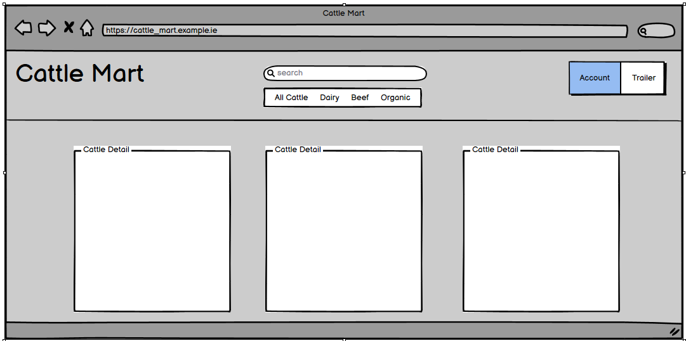

# Cattle-Mart

A catle sales website. Code Institute Portfolio 5 Assessment
#### - By FarmerEd

### [Live Site:](https://cattle-mart-42a123405ccb.herokuapp.com/)  
### [Repository:](https://github.com/Farmer-Eds-Shed/Cattle-Mart/)

---
## Contents
<a name="contents"><a>
 1. [ User Experience UX ](#user-experience-ux)
 1. [Agile Development](#agile-development)
 1. [ Features ](#features)   
 1. [ Technology used ](#technology-used) 
 1. [ Testing ](#testing)  
 1. [ Bugs ](#bugs)  
 1. [ Deployment ](#deployment)
 1. [ SEO ](#seo)
 1. [ Marketing ](#marketing)
 1. [ Business Model](#business)
 1. [ Credits](#credits)
  

## User Experience UX

A visitor to Cattle-Mart would be a farmer looking to purchase animals for any cattle enterprise Beef/Dairy/Organic 
### User Stories
[Project Canban](https://github.com/users/Farmer-Eds-Shed/projects/4)

#### Epic | Site Deployment
- As a Site Devloper, I can setup and deploy using Django

#### Epic | User Managment
- As a site user I can register an account so that I can access and edit profile data.
- As a site user I can access purchase history.
- As a site user I can reset my own password.
- As a site admin I can manage user accounts.

#### Epic | Site Navigation
- As a Site User I can filter stock by type.
- As a site user I can view /add /remove trailer items.

#### Epic | E-Commerce
- As a site user I can purchase animals from my trailer.
- As a site user I will receive e-mail confirmation of my order.

#### Epic | Marketing
- As a site user I can subscribe to a newsletter.
- As a site user I can unsubscribe from a news letter.

#### Epic | Contact
- As a site user I can contact the business.

[Back to Top of page](#contents)

### PLanning

- Wireframes

  ### Cattle list
  

- Database Schema

   ### Cattle
    - #### Enterprise
        | id | Field |
        |--|--|
        |name|CharField|

     - #### StockType
        | id | Field |
        |--|--|
        |name|CharField|

     - #### Breed

        | id | Field |
        |--|--|
        |name|CharField|
        |code|CharField|
      
    - #### Cattle
        | id | Field |
        |--|--|
        |enterprise|ForeignKey|
        |stock_type|ForeignKey|
        |tag||CharField|
        |name|CharField|
        |breed|ForeignKey|
        |description|TextField|
        |price|IntegerField|
        |star_rating|IntegerField|
        |cbv|IntegerField|
        |image_url|UrlField|
        |image|ImageField|
        |sold|BooleanField|

   ### Checkout
    - #### Order
        | id | Field |
        |--|--|
        |order number|CharField|
        |user_profile|ForeignKey|
        |full_name|CharField|
        |email|EmailField|
        |phone_number|CharField|
        |country|CountryField|
        |postcode|CharField|
        |town_or_city|CharField|
        |street_address1|CharField|
        |street_address2|CharField|
        |county|CharField|
        |date|DateTimeField|
        |delivery_cost|DecimalField| *To Be removed as not used
        |Order_Total|DecimalField|
        |Grand_Total|DecimalField| *To Be removed as not used
        |original_trailer|TextField|
        |stripe_PID|CharField

    - #### OrderLineItem
        | id | Field |
        |--|--|
        |order|ForeignKey|
        |cattleForeignKey|
        |quantity|IntegerField|
        |line_item_total|DecimalField
        |Read|BooleanField|

   ### Contact
    - #### Feedback
        | id | Field |
        |--|--|
        |issue|ForeignKey
        |name|CharField|
        |email|EmailField|
        |message|TextField|

   ### Profile
    - #### UserProfile
        | id | Field |
        |--|--|
        |user|OneToOneField
        |default_phone_number|CharField|
        |default_country|CountryField|
        |default_postcode|CharField|
        |default_town_or_city|CharField|
        |default_street_address1|CharField|
        |default_street_address2|CharField|
        |default_county|CharField|

[Back to Top of page](#contents)

## Agile Development

This project was developed following the principles of Agile Development, GitHub Projects and Milestones were used to track planning and progress.  

User stories were created as Issues and assigned to a Milestone(Epic), progress was tracked via the projects board. Each user story was given an acceptance criteria to clearly define when it was completed.  

As User Stories were worked on they were moved into the "In Progress" section of the Project board, when a user story matched its acceptance criteria it was closed and moved the  "Done" section. When new features were decided upon after the initial project planning they were also added to the "To Do" Section. 

[Back to Top of page](#contents)

## Features

#### User based Features Implemented:
- Users can browse the site for cattle available for sale.
- Users can create an account.
- Users can update Billing Adress.
- Users can view past orders.
- Users can purchase cattle through the sites payment system.
- Users can contact the business through a contact form.

#### Admin based features Implemented:
- Admins can add cattle for Sale.
- Admins can edit existing cattle.
- Admins can delete existing cattle.

#### Account restrictions:
- Unathenticated users cannot access profile data.
- Non admin users cannot add or edit cattle data. 

### Features Left to Implement

- Site needs a mechenisim to archive sold animals
- A front end view for admins to deal with contact requests
- A Blog

[Back to Top of page](#contents)

##  Technology Used

### Html

 - Used to structure webpages and the base templating language

### CSS

 - Custom CSS used to style the pages and give the site an agri theme.

### JavaScript

 -  Used to add comments CRUD functionality, like / made_this functions and to activate Bootstrap dropdown menus. 

### Python

 -  Used for the logic in this project.

### Django

 -  Framework used to build this project. Provides a ready installed admin panel and includes many helper template tags that make writing code quick and efficient.

### Stripe

- Stripe paments system.

### MailChimp

- email Marketing with API for managing subscriptions to News letter.

### Font Awesome

 -  Icon library used for Icons on links and like buttons.

### Bootstrap 5
 - Used as the base front end framework to work alongside Django

### Jinja Templating with Django
 - Used to render logic within html documents and make the website more dynamic.

### GitHub
 - Used to store the code for this project & for the projects Kanban board used to complete it.

### Heroku
- Used to host and deploy this project

### Elephant PostgreSQL
-Heroku PostgreSQL was used as the database for this project during development and in production.

### Amazon AWS
- Used to host the static files for this project.

### Git
- Used for version control throughout the project and to ensure a good clean record of work done was maintained.

[Back to Top of page](#contents)

---

## Testing

Manual testing was used through out the project development. Results of the final testing phase are shown below.

#### Account Registration Tests

| Test | Result |
|--|--|
|User can create account|Pass|
|User can log into account|Pass|
|User can log out of account|Pass|

---

#### Visitor Navigation Tests

| Test | Result |
|--|--|
|Vistor can view Home Page|Pass|
|All links on Home Page open|Pass|
|Visitor can browse cattle|Pass|
|Visitor can view cattle details|Pass|
|Tooltips on CBV and ICBF work|Pass|
|Already sold cattle cannot be added to trailer|Pass|
|Visitor can add cattle to trailer|Pass|
|Visitor can view trailer|Pass|
|Visitor can complete a purchase|Pass|
|Visitors order conformation displays|Pass|
|Visitor can use the contact form|Pass|
|Visitor can use the Search feature|Pass|
|Visitor can sign up for news letter|

---

#### Search Tests

| Test | Result |
|--|--|
|User can search posts by stock type|Pass|
|User can search posts by enterprise|Pass|
|User can search posts by animal name|Pass|
|User can search posts by description|Pass|

---

#### Security Tests

| Test | Result|
|--|--|
|Visitor can not access Profile Area|Pass|
|Visitor can not add stock|Pass|
|Visitor can not edit stock|Pass|
|Visitor can not delete stock|Pass|

---

#### CRUD Tests

| Test |Result|Notes|
|--|--|--|
|Visitors can use contact form|Pass|
|Members can use contact forms|Pass|
|Members can edit billing details|Pass|
|Admin users can add new stock|Pass|
|Admin users can edit stock|Pass|
|Admin users can delete stock|Pass|May cause issues for trailers and order history - Archive might be a better option for production site|

--- 

#### MailChimp Tests

| Test |Result|
|--|--|
|Anyone can signup for newsletter|Pass|
|Anyone can cancel newsletter|Pass|

--- 

#### Trailer Tests (Shopping Cart)

| Test |Result|
|--|--|
|Anyone can put an animal in trailer|Pass|
|Anyone can put additional animals in trailer|Pass|
|Anyone can remove an animal from their trailer|Pass|

--- 

#### Checkout Tests

| Test |Result  |Notes|
|--|--|--|
|members saved details load|Pass|
|Unable to complete order if animal in trailer is already sold|Pass|Race condition exists which needs resolving before production release|
|Payments Complete|Pass|
|Order summery displays|Pass|
Confirmation emails send|Pass|

---

#### Contact Form Tests

| Test |Result  |
|--|--|
|Users can submit a feedback form|Pass|
|Users can select issue from dropdown list|Pass|

### Responsiveness testing
Responsiveness testing was performed using:
- https://ui.dev/amiresponsive
 - Needed a [Chrome plugin](https://chromewebstore.google.com/detail/ignore-x-frame-headers/gleekbfjekiniecknbkamfmkohkpodhe) to temporally disable X-Frame headers.
- Testing Site on an Android Mobile.
- Using Chromes Developer tools.

### Code Validation

Code to be run through the following validations tools.
- [W3 HTML Validator](https://validator.w3.org/)
   - [Home Page](https://validator.w3.org/nu/?doc=https%3A%2F%2Fcattle-mart-42a123405ccb.herokuapp.com%2F)
   - [All Cattle](https://validator.w3.org/nu/?showsource=yes&doc=https%3A%2F%2Fcattle-mart-42a123405ccb.herokuapp.com%2Fcattle%2F%3Fsort%3Dprice%26direction%3Dasc)
   - [Trailer](https://validator.w3.org/nu/?showsource=yes&doc=https%3A%2F%2Fcattle-mart-42a123405ccb.herokuapp.com%2Ftrailer)
   - [Checkout](https://validator.w3.org/nu/?doc=https%3A%2F%2Fcattle-mart-42a123405ccb.herokuapp.com%2Ftrailer%2F)
   - [Contact](https://validator.w3.org/nu/?doc=https%3A%2F%2Fcattle-mart-42a123405ccb.herokuapp.com%2Fcontact%2F)
   - [Login](https://validator.w3.org/nu/?showsource=yes&doc=https%3A%2F%2Fcattle-mart-42a123405ccb.herokuapp.com%2Faccounts%2Flogin%2F)
   - [Register](https://validator.w3.org/nu/?showsource=yes&doc=https%3A%2F%2Fcattle-mart-42a123405ccb.herokuapp.com%2Faccounts%2Fsignup%2F)

- [W3 CSS Validator](https://jigsaw.w3.org/css-validator/validator.html.en)
   - [Home Page](https://jigsaw.w3.org/css-validator/validator?uri=https%3A%2F%2Fcattle-mart-42a123405ccb.herokuapp.com%2F&profile=css3svg&usermedium=all&warning=1&vextwarning=&lang=en)
   - [All Cattle](https://jigsaw.w3.org/css-validator/validator?uri=https%3A%2F%2Fcattle-mart-42a123405ccb.herokuapp.com%2Fcattle%2F%3Fsort%3Dprice%26direction%3Dasc&profile=css3svg&usermedium=all&warning=1&vextwarning=&lang=en)
   - [Trailer](https://jigsaw.w3.org/css-validator/validator?uri=https%3A%2F%2Fcattle-mart-42a123405ccb.herokuapp.com%2Ftrailer%2F&profile=css3svg&usermedium=all&warning=1&vextwarning=&lang=en)
   - [Checkout](https://jigsaw.w3.org/css-validator/validator?uri=https%3A%2F%2Fcattle-mart-42a123405ccb.herokuapp.com%2Fcheckout%2F&profile=css3svg&usermedium=all&warning=1&vextwarning=&lang=en)
   - [Contact](https://jigsaw.w3.org/css-validator/validator?uri=https%3A%2F%2Fcattle-mart-42a123405ccb.herokuapp.com%2Fcontact%2F&profile=css3svg&usermedium=all&warning=1&vextwarning=&lang=en)
   - [Login](https://jigsaw.w3.org/css-validator/validator?uri=https%3A%2F%2Fcattle-mart-42a123405ccb.herokuapp.com%2Faccounts%2Flogin%2F&profile=css3svg&usermedium=all&warning=1&vextwarning=&lang=en)
   - [Register](https://jigsaw.w3.org/css-validator/validator?uri=https%3A%2F%2Fcattle-mart-42a123405ccb.herokuapp.com%2Faccounts%2Fsignup%2F&profile=css3svg&usermedium=all&warning=1&vextwarning=&lang=en)
     
- [CI Python Linter](https://pep8ci.herokuapp.com/)
- [JSHint ](https://jshint.com/)

[Back to Top of page](#contents)

## Bugs

#### UnResolved Bugs

| Bug | Comment |
|--|--|
|Code 500 if animal deleted is in Trailer|Cookie needs to be deleteted to resolve|
|Race Condition at point of sale|Only one of each animal can exist, potential for 2 buyers to complete purchase|

- **Code 500:** Probably the best way to deal with this issue is to not allow a full delete of the animal as it should remain in the database for tracking of sales anyway. An archive option would make far more sense in ths case.
- **Race Condition:** This issue could be handled in a number of ways, but would require more work than there is time for before submission. The trailer (bag/shopping cart) was based on the Boutiqu-Ado tutorial contexts example, it may have been a better idea to create a trailer database model instead, where additional holds may be placed on animals depending on the stage of the transaction with different potential buyers trailers. This site would likely be low volume high value sales so unlikey to create too much of a performace overhead.    
 

[Back to Top of page](#contents)

## Deployment

To deploy the project through Heroku follow these steps:

### Create the Heroku App:

- Sign up / Log in to  [Heroku](https://www.heroku.com/)
- From  Heroku Dashboard page select 'New' and then 'Create New App'
- Give the project a name.
- After select create app. 
- The name for the app must be unique..
- Heroku will create the app and bring you to the deploy tab.

### Attach the Postgres database:
 
- Create an account with [ElephantSQL](https://elephantsql.com/) and sign up for Tiny Turtle Plan(free).
- Create a new instance.
- Check that Postgres version is 12 or over in Stats tab.
- Copy Database URL from Details Tab.
- Return to Heroku, Click on the setting tab.
- Open the config vars section add a variable named DATABASE_URL.
- Paste the Postgres URL to the value field.

### Prepare the environment and settings.py file:

- Inside the Django app repository create a new file called env.py
- Import the os library and set the environment variable for the DATABASE_URL pasting in the PostGres URL. 
- The line should appear as os.environ["DATABASE_URL"]= "Paste the link in here"
- Add a secret key to the app using os.environ["SECRET_KEY"] = "your secret key goes here"
- Add the secret key just created to the Heroku Config Vars as SECRET_KEY for the KEY value and the secret key value you created as the VALUE
- In the settings.py file within the django app, import Path from pathlib, import os and import dj_database_url
- insert the line if os.path.isfile("env.py"): import env
- remove the insecure secret key that django has in the settings file by default and replace it with SECRET_KEY = os.environ.get('SECRET_KEY')
- replace the databases section with DATABASES = { 'default': dj_database_url.parse(os.environ.get("DATABASE_URL"))} ensure the correct indentation for python is used.
- In the terminal migrate the models over to the new database connection

### Create files / directories:

-   In your code editor, create three new top level folders, media, static, templates
-   Create a new file on the top level directory - Procfile
-   Within the Procfile add the code - web: guincorn PROJECT_NAME.wsgi
-   In the terminal, add the changed files, commit and push to GitHub

### Deploy:

-   NB: Ensure in Django settings, DEBUG is False
-   In Heroku, navigate to the deployment tab and deploy the branch manually - watch the build logs for any errors.
-   Heroku will now build the app for you. Once it has completed the build process you will see a 'Your App Was Successfully Deployed' message and a link to the app to visit the live site.

[Back to Top of page](#contents)

## SEO

- A robots.txt file
- A **sitemap.xml** file generated using [Sitemaps.com](https://www.xml-sitemaps.com/details-cattle-mart-42a123405ccb.herokuapp.com-52d985ad9.html)
- **Descriptive meta tags:** 
  - **Keywords:** cattle, cattle sales, beef cattle sales, dairy cattle sales, calves, bulls, cows, heifers, bullocks
  - **Site Description:** Cattle Mart, page for advertising and sales of our cattle

[Back to Top of page](#contents)

## Marketing

- Implemented Mailchip Subscribe and Usubscribe form using the  [Mailchimp API](https://mailchimp.com/integrations/?igaag=160461836334&igaat=&igacm=21247734929&igacr=698073834376&igakw=mailchimp%2520api&igamt=e&igant=g&ds_c=DEPT_AOC_Google_Search_UKI_EN_Brand_Acquire_Omega_MKAG_UKI&ds_kids=p80048369373&ds_a_lid=kwd-303435804373&ds_cid=71700000118582195&ds_agid=58700008710455191&gad_source=1&gclid=Cj0KCQjw28W2BhC7ARIsAPerrcLW01KPdkVaVbqFRv0CUB3uHjk5hKHLO5Mw0QagF_SGjKu8celXTgEaAhz_EALw_wcB&gclsrc=aw.ds)
- [Facebook Busineess Page](https://www.facebook.com/FarmerEdsShed)

[Back to Top of page](#contents)

## Business Model

- Cattle Mart is a B2B e-commerce website that specializes in the sale of cattle from a large cattle dealer to individual farmers. 
 - To achieve our business goals, we carefully select our cattle from quality cattle breeder/producers both nationwide and internationally.
 - To support our business model, we supply a friendly service, with extensive knowlage of all breeds within the various cattle enterprises.

[Back to Top of page](#contents)

## Credits

- [Alan Bushell](https://github.com/Alan-Bushell) - Readme template
- [Bootstrap Docs](https://getbootstrap.com/docs/4.1/getting-started/introduction/) - General bootstrap documentation
- [Django Docs](https://docs.djangoproject.com/en/5.0/) - Django
- [Favicon.io](https://favicon.io/") - Favicon
- [Code Institute WalkThroughs](https://learn.codeinstitute.net/dashboard) - Boiler plate code and more.
- [MailChimp Marketing](https://testdriven.io/blog/django-mailchimp/) - Mailchimp subscribe/unsubscribe form

[Back to Top of page](#contents)

